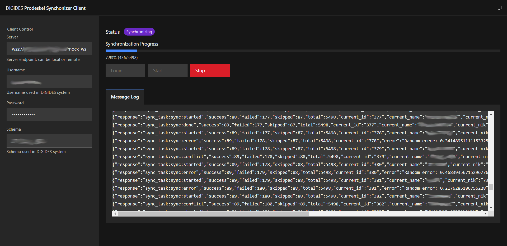

# Prodeskel WebSocket Client Demo

A simple demonstration of DIGIDES Prodeskel WebSocket usage and 
[prodeskel-ws](https://github.com/slainless/prodeskel-ws) integration to the app.

Thanks to the current state of the technologies, it allows you to create an app 
with just one HTML file. 
Built on top of 
[Carbon Web Components](https://web-components.carbondesignsystem.com),
with a bit of help from [TailwindCSS](https://tailwindcss.com/) 
and finally using [AlpineJS](https://alpinejs.dev/) as the reactive engine/framework.

Heck, I even do an SSR pass on the client, to render actual web components as string
using [@lit-labs/ssr](https://esm.sh/@lit-labs/ssr). OK, honestly this one is just a flex.

All the javascript dependencies are loaded from [esm.sh](https://esm.sh/).

## Usage

This client is purely for demonstration purpose so it's a bit crude and probably
not very optimized. Also, while this demo client is viewable in public domain, 
the server is actually only accessible for DIGIDES end-user (who has access to DIGIDES 
system and [prodeskel system](https://prodeskel.binapemdes.kemendagri.go.id/)).

And obviously, the default server address is not the true address of DIGIDES
prodeskel server to prevent abuse, sorry!

## Demo video

